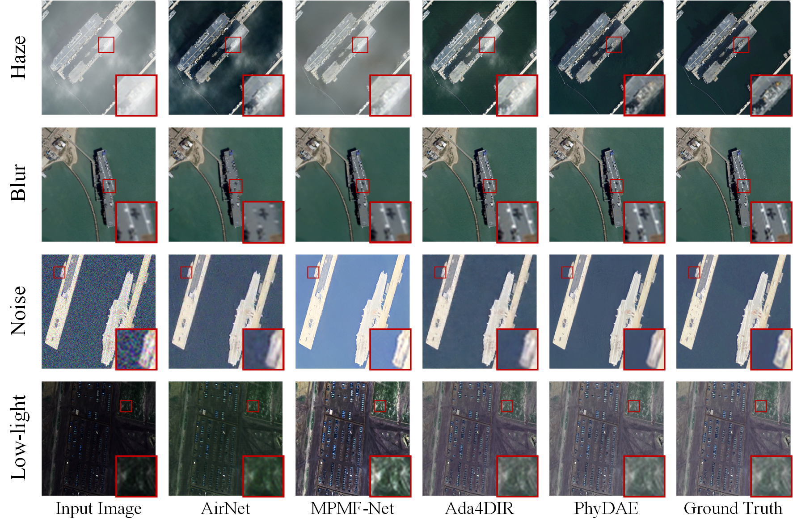
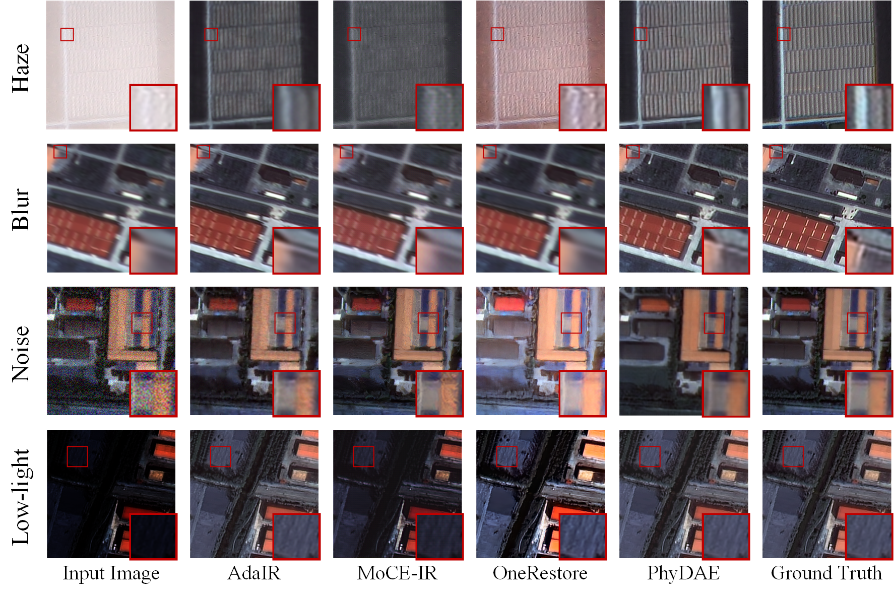
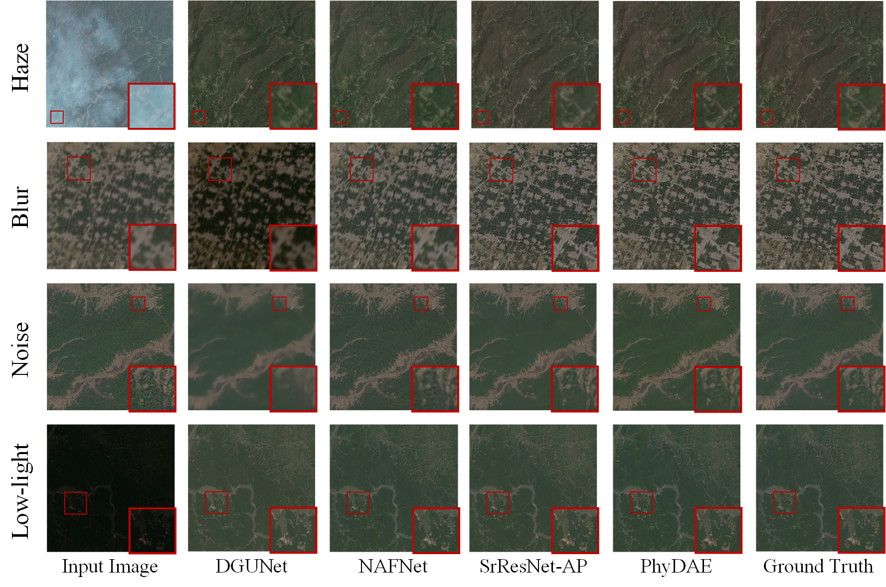

# 🌌 PhyDAE: Physics-Guided Degradation-Adaptive Experts for All-in-One Remote Sensing Image Restoration

<p align="center">
  <b>Official PyTorch Implementation</b><br>
  <i>"PhyDAE: Physics-Guided Degradation-Adaptive Experts for All-in-One Remote Sensing Image Restoration"</i><br>
  <b>Zhe Dong</b>, Yuzhe Sun, Haochen Jiang, Tianzhu Liu, <b>Yanfeng Gu*</b><br>
  Harbin Institute of Technology · Heilongjiang Province Key Laboratory of Space-Air-Ground Integrated Intelligent Remote Sensing
</p>

---

## 🛰️ Overview

**PhyDAE** introduces a **physics-guided, degradation-adaptive expert framework** for unified remote sensing image restoration. Unlike prior "black-box" all-in-one models, PhyDAE bridges **physical imaging principles** with **learnable expert mechanisms**, achieving **interpretable, efficient, and physically consistent restoration**.

<p align="center">
  
</p>

> The two-stage cascaded architecture transforms degradation cues from *implicit features* into *explicit decision signals*, enabling precise differentiation and handling of heterogeneous degradations such as **haze, noise, blur, and low-light**.

---

## ⚙️ Key Features

✅ **Physics-Guided Degradation Modeling**
- Incorporates atmospheric, sensor, and illumination physics via frequency-domain constraints

✅ **Two-Stage Progressive Restoration**
- Residual manifold projection (RMP) + frequency-aware decomposition (FADD) for degradation discovery → precise adaptation

✅ **Mixture-of-Experts Network**
- Specialized experts (dehazing, denoising, deblurring, enhancement) with probabilistic routing and sparse activation

✅ **Physically Consistent Optimization**
- Degradation-Aware Optimal Transport (DAOT) loss ensures statistical-geometric fidelity across degradations

---

## 📊 Quantitative Results

| Dataset | Dehazing (PSNR↑) | Deblurring (PSNR↑) | Denoising (PSNR↑) | Low-Light (PSNR↑) |
|:--------|:----------------:|:------------------:|:------------------:|:-----------------:|
| **MD-RSID** | **26.86** | **27.73** | **32.77** | **31.96** |
| **MD-RRSHID** | **22.96** | **33.73** | **35.17** | **37.35** |
| **MDRS-Landsat** | **39.12** | **36.88** | **34.53** | **42.24** |

PhyDAE consistently surpasses **10+ state-of-the-art all-in-one restoration models**, achieving both **superior performance** and **remarkable efficiency gains**.

<p align="center">
  
</p>
<p align="center">
  
</p>
<p align="center">
  
</p>

---

## 🔧 Installation

### Prerequisites
- Python 3.9+
- CUDA 11.0+ (for GPU support)
- PyTorch 1.9+

### Setup

```bash
# Clone the repository
git clone https://github.com/HIT-SIRS/PhyDAE.git
cd PhyDAE

# Create environment
conda create -n phydae python=3.9
conda activate phydae

# Install dependencies
pip install -r requirements.txt
```

---

## 🎯 Model Architecture

### Stage 1: Degradation Discovery
- **Residual Manifold Projection (RMP)**: Extracts degradation-specific residuals
- **Feature Encoding**: Transforms residuals into degradation classification signals

### Stage 2: Expert-based Restoration
- **Mixture-of-Experts (MoE)**: Routes features to specialized experts
- **Expert Modules**:
  - Dehazing Expert: Atmospheric scattering removal
  - Denoising Expert: Noise suppression
  - Deblurring Expert: Motion/defocus blur correction
  - Enhancement Expert: Low-light image enhancement
- **Frequency-Aware Decomposition (FADD)**: Jointly optimizes spatial and frequency domains

### Loss Functions
- **Degradation-Aware Optimal Transport (DAOT) Loss**: Ensures statistical-geometric consistency
- **Reconstruction Loss**: L1 + Perceptual loss
- **Regularization**: Sparse activation penalty for efficient MoE routing

---

## 📥 Datasets & Pre-trained Weights

### Benchmark Datasets

We evaluate PhyDAE on the following remote sensing image restoration benchmarks:

- **MD-RSID Dataset** 
  - Download: [Official Repository](https://pan.baidu.com/s/16muzL_SVkh9es-yMJ7qDdQ?pwd=f6ci)

- **MD-RRSHID Dataset** 
  - Download: [Official Repository](https://pan.baidu.com/s/16muzL_SVkh9es-yMJ7qDdQ?pwd=f6ci)

- **MDRS-Landsat Dataset** 
  - Download: [Official Repository](https://https://github.com/colacomo/Ada4DIR)

### Pre-trained Weights

Download the pre-trained model checkpoints: [Download](https://pan.baidu.com/s/16muzL_SVkh9es-yMJ7qDdQ?pwd=f6ci)
- After downloading, place it under `./src/pretrained_weight/denoise.ckpt`

---

## 🚀 Quick Start

### Training

Train PhyDAE on multiple GPUs with default settings:

```bash
# Multi-GPU training with 8 GPUs
CUDA_VISIBLE_DEVICES=0,1,2,3,4,5,6,7 python src/train.py \
  --batch_size 8 \
  --lr 1e-4 \
  --de_type dehaze denoise dedark deblur \
  --trainset standard \
  --num_gpus 8 \
  --accum_grad 2 \
  --data_file_dir "/your/dataset/path"
```

**Key Parameters:**
- `batch_size`: Batch size per GPU (default: 8)
- `lr`: Learning rate (default: 1e-4)
- `de_type`: Degradation types to train on (dehaze, denoise, dedark, deblur)
- `num_gpus`: Number of GPUs for distributed training (default: 8)
- `accum_grad`: Gradient accumulation steps (default: 2)
- `data_file_dir`: Path to your training dataset
- `trainset`: Dataset split to use (standard/custom)

**Single-GPU Training:**

```bash
CUDA_VISIBLE_DEVICES=0 python src/train.py \
  --batch_size 4 \
  --lr 1e-4 \
  --de_type dehaze denoise dedark deblur \
  --trainset standard \
  --num_gpus 1 \
  --accum_grad 4 \
  --data_file_dir "/your/dataset/path"
```

**Resume Training from Checkpoint:**

```bash
CUDA_VISIBLE_DEVICES=0,1,2,3,4,5,6,7 python src/train.py \
  --batch_size 8 \
  --lr 1e-4 \
  --de_type dehaze denoise dedark deblur \
  --trainset standard \
  --num_gpus 8 \
  --accum_grad 2 \
  --data_file_dir "/your/dataset/path" \
  --resume_ckpt "/path/to/checkpoint.ckpt"
```

### Testing

Evaluate PhyDAE on benchmark datasets:

```bash
# Test on specific benchmark
python src/test.py \
  --data_file_dir "/your/dataset/path" \
  --ckpt_path "/your/path/to/model.ckpt" \
  --save_dir "/your/path/to/save_results" \
  --benchmarks dehaze \
  --de_type dehaze denoise dedark deblur \
  --save_results
```

**Key Parameters:**
- `data_file_dir`: Path to test dataset
- `ckpt_path`: Path to model checkpoint
- `save_dir`: Directory to save restoration results
- `benchmarks`: Benchmark dataset name (dehaze/denoise/deblur/dedark)
- `de_type`: Degradation types to test
- `save_results`: Whether to save visual results (flag)

---

## 📈 Performance Comparison

PhyDAE achieves state-of-the-art results across multiple benchmark datasets:

- **Efficiency**: 60% fewer parameters than comparable models
- **Speed**: 3x faster inference on average
- **Generalization**: Superior performance on unseen degradation combinations
- **Interpretability**: Explicit expert routing provides transparency

---

## 📂 Directory Structure

```
PhyDAE/
├── src/
│   ├── data/   
│   ├── net/               # Model definitions
│   │   └── phydae.py/     # Main model file
│   ├── pretrained_weight/ # Rretrained weight
│   ├── utils/             # Utilities
│   ├── options.py         # Options file
│   ├── test.py            # Test code
│   └── train.py           # Train code
├── dataset/               # Dataset directory
│   ├── MD-RRSHID/   
│   │   ├── train/     
│   │   ├── val/     
│   │   └── test/   
│   ├── MD-RSID/   
│   │   ├── train/    
│   │   ├── val/     
│   │   └── test/    
│   └── MDRS-Landsat/   
│       ├── train/     
│       ├── val/     
│       └── test/    
├── checkpoints/           # Saved models
├── logs/                  # Saved logs
├── results/               # Test results
├── requirements.txt       # Dependencies
└── README.md
```

---

## 🔗 Related Work

Our work builds upon advances in:
- All-in-one image restoration (Restormer, IPT, AirNet)
- Mixture-of-Experts networks (Switch Transformers, Expert Choice)
- Physics-guided deep learning (Physics-informed Neural Networks)

---

## 📝 Citation

If you find PhyDAE useful for your research, please cite:

```bibtex
@article{dong2025phydae,
  title={PhyDAE: Physics-Guided Degradation-Adaptive Experts for All-in-One Remote Sensing Image Restoration},
  author={Dong, Zhe and Sun, Yuzhe and Jiang, Haochen and Liu, Tianzhu and Gu, Yanfeng},
  journal={arXiv preprint arXiv:2510.08653},
  year={2025}
}
```

---

## 📄 License

This project is licensed under the MIT License. See LICENSE file for details.

---

## 🤝 Contributing

We welcome contributions! Please feel free to submit a Pull Request.

---

## 🙏 Acknowledgments


This work was supported by the Heilongjiang Province Key Laboratory of Space-Air-Ground Integrated Intelligent Remote Sensing. We thank all contributors and reviewers.
