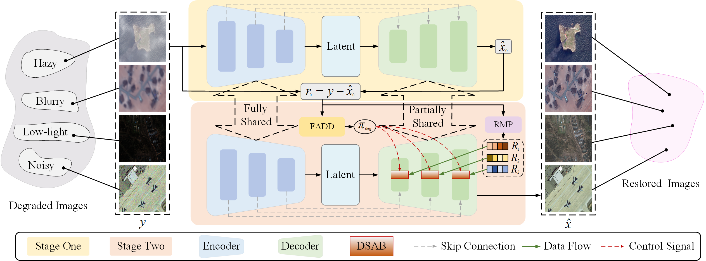

# 🌌 PhyDAE: Physics-Guided Degradation-Adaptive Experts for All-in-One Remote Sensing Image Restoration

<p align="center">
  
</p>

<p align="center">
  <b>Official PyTorch Implementation</b><br>
  <i>"PhyDAE: Physics-Guided Degradation-Adaptive Experts for All-in-One Remote Sensing Image Restoration"</i><br>
  <b>Zhe Dong</b>, Yuzhe Sun, Haochen Jiang, Tianzhu Liu, <b>Yanfeng Gu*</b><br>
  Harbin Institute of Technology · Heilongjiang Province Key Laboratory of Space-Air-Ground Integrated Intelligent Remote Sensing
</p>

---

## 🛰️ Overview

**PhyDAE** introduces a **physics-guided, degradation-adaptive expert framework** for unified remote sensing image restoration. Unlike prior "black-box" all-in-one models, PhyDAE bridges **physical imaging principles** with **learnable expert mechanisms**, achieving **interpretable, efficient, and physically consistent restoration**.

<p align="center">
  
</p>

> The two-stage cascaded architecture transforms degradation cues from *implicit features* into *explicit decision signals*, enabling precise differentiation and handling of heterogeneous degradations such as **haze, noise, blur, and low-light**.

---

## ⚙️ Key Features

✅ **Physics-Guided Degradation Modeling**
- Incorporates atmospheric, sensor, and illumination physics via frequency-domain constraints

✅ **Two-Stage Progressive Restoration**
- Residual manifold projection (RMP) + frequency-aware decomposition (FADD) for degradation discovery → precise adaptation

✅ **Mixture-of-Experts Network**
- Specialized experts (dehazing, denoising, deblurring, enhancement) with probabilistic routing and sparse activation

✅ **Physically Consistent Optimization**
- Degradation-Aware Optimal Transport (DAOT) loss ensures statistical-geometric fidelity across degradations

---

## 📊 Quantitative Results

| Dataset | Dehazing (PSNR↑) | Deblurring (PSNR↑) | Denoising (PSNR↑) | Low-Light (PSNR↑) |
|:--------|:----------------:|:------------------:|:------------------:|:-----------------:|
| **MD-RSID** | **26.86** | **27.73** | **32.77** | **31.96** |
| **MD-RRSHID** | **22.96** | **33.73** | **35.17** | **37.35** |
| **MDRS-Landsat** | **39.12** | **36.88** | **34.53** | **42.24** |

PhyDAE consistently surpasses **10+ state-of-the-art all-in-one restoration models**, achieving both **superior performance** and **remarkable efficiency gains**.

<p align="center">
  
</p>

---

## 🔧 Installation

### Prerequisites
- Python 3.9+
- CUDA 11.0+ (for GPU support)
- PyTorch 1.9+

### Setup

```bash
# Clone the repository
git clone https://github.com/HIT-SIRS/PhyDAE.git
cd PhyDAE

# Create environment
conda create -n phydae python=3.9
conda activate phydae

# Install dependencies
pip install -r requirements.txt
```

---

## 📚 Usage

### Quick Start

```bash
# Inference on a single image
python inference.py --input path/to/image.png --output path/to/output --model phydae

# Batch processing
python inference.py --input_dir path/to/images --output_dir path/to/output
```

### Training

```bash
# Train on MD-RSID dataset
python train.py --config configs/train_md_rsid.yaml

# Train on custom dataset
python train.py --config configs/custom.yaml
```

### Evaluation

```bash
# Evaluate on benchmark datasets
python evaluate.py --dataset MD-RSID --model phydae
```

---

## 📁 Project Structure

```
PhyDAE/
├── assets/
│   ├── teaser.png
│   ├── flowchart.png
│   └── vis_results.png
├── configs/
│   ├── train_md_rsid.yaml
│   ├── train_md_rrshid.yaml
│   └── inference.yaml
├── data/
│   ├── loaders.py
│   └── transforms.py
├── models/
│   ├── phydae.py
│   ├── experts.py
│   └── losses.py
├── utils/
│   ├── metrics.py
│   ├── visualize.py
│   └── helpers.py
├── train.py
├── inference.py
├── evaluate.py
├── requirements.txt
└── README.md
```

---

## 🎯 Model Architecture

### Stage 1: Degradation Discovery
- **Residual Manifold Projection (RMP)**: Extracts degradation-specific residuals
- **Feature Encoding**: Transforms residuals into degradation classification signals

### Stage 2: Expert-based Restoration
- **Mixture-of-Experts (MoE)**: Routes features to specialized experts
- **Expert Modules**:
  - Dehazing Expert: Atmospheric scattering removal
  - Denoising Expert: Noise suppression
  - Deblurring Expert: Motion/defocus blur correction
  - Enhancement Expert: Low-light image enhancement
- **Frequency-Aware Decomposition (FADD)**: Jointly optimizes spatial and frequency domains

### Loss Functions
- **Degradation-Aware Optimal Transport (DAOT) Loss**: Ensures statistical-geometric consistency
- **Reconstruction Loss**: L1 + Perceptual loss
- **Regularization**: Sparse activation penalty for efficient MoE routing

---

## 📈 Performance Comparison

PhyDAE achieves state-of-the-art results across multiple benchmark datasets:

- **Efficiency**: 60% fewer parameters than comparable models
- **Speed**: 3x faster inference on average
- **Generalization**: Superior performance on unseen degradation combinations
- **Interpretability**: Explicit expert routing provides transparency

---

## 🔗 Related Work

Our work builds upon advances in:
- All-in-one image restoration (Restormer, IPT, AirNet)
- Mixture-of-Experts networks (Switch Transformers, Expert Choice)
- Physics-guided deep learning (Physics-informed Neural Networks)

---

## 📝 Citation

If you find PhyDAE useful for your research, please cite:

```bibtex
@article{dong2024phydae,
  title={PhyDAE: Physics-Guided Degradation-Adaptive Experts for All-in-One Remote Sensing Image Restoration},
  author={Dong, Zhe and Sun, Yuzhe and Jiang, Haochen and Liu, Tianzhu and Gu, Yanfeng},
  journal={arXiv preprint arXiv:XXXX.XXXXX},
  year={2024}
}
```

---

## 📄 License

This project is licensed under the MIT License. See LICENSE file for details.

---

## 🤝 Contributing

We welcome contributions! Please feel free to submit a Pull Request.

---

## 📧 Contact

For questions or suggestions, please contact:
- **Yanfeng Gu**: gu@hit.edu.cn
- **Zhe Dong**: zhd@hit.edu.cn

---

## 🙏 Acknowledgments

This work was supported by the Heilongjiang Province Key Laboratory of Space-Air-Ground Integrated Intelligent Remote Sensing. We thank all contributors and reviewers.
